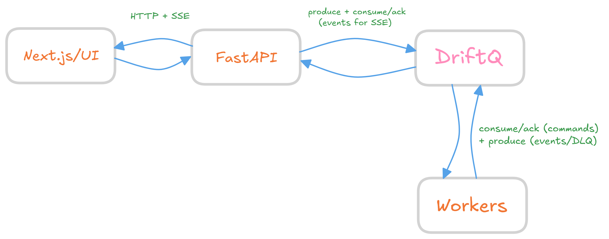

# DriftQ Starter: FastAPI + Next.js (2‑Minute DLQ → Replay → Success Demo) 🚀

This repo is a **tiny "show it, don’t explain it" demo** of DriftQ running behind a normal **FastAPI + Next.js** app.

## Architecture


What you'll see in ~2 minutes:
- FastAPI starts a "run" (basically "do this job") and publishes a command to DriftQ (think: enqueue work with a payload)
- DriftQ holds that command durably (and the event stream for the run)
- A worker (your executor) picks up that command from DriftQ. In a real app this worker is usually where you’d do stuff like:
  - call an LLM (OpenAI/Anthropic/local)
  - hit external APIs (Slack/Jira/GitHub/etc)
  - run multi-step logic
- If the work fails, the worker retries automatically (up to max_attempts). If it still can’t succeed, it writes a **DLQ** record with the original payload + error so the job isn’t lost.
- Next.js UI watches everything live via **SSE** (Server-Sent Events). You’ll see the run timeline update in real time, inspect the DLQ payload, and then hit **Replay (fix applied)** to re-run the same job after "fixing" the cause (in this demo, replay clears fail_at so it succeeds).

> Heads up: **DriftQ itself is way more powerful** than what this repo shows.
> This is intentionally the smallest slice that proves the "DLQ → Replay → Success" story.
> If you want the real engine + features, check out the **[DriftQ-Core](https://github.com/driftq-org/DriftQ-Core)** repo

---

## The punchline ✅

Open the UI, click **🗂️ 2‑Minute Demo**, and you should see:

1) **Fail (forced)**
2) **DLQ persisted** (inspect the payload)
3) **Replay with fix applied** (replay overrides `fail_at`)
4) **Success** 🎉

If it doesn’t reach Success, it’s almost always one of these:
- the worker isn’t running (manual path), or
- the replay endpoint isn’t actually applying `{"fail_at": null}`

---

## Fail modes (what that dropdown actually means) 🎛️

In the UI you’ll see a `Fail:` dropdown. This is **demo-only** — it’s just a chaos knob to force a failure at a specific stage so you can prove retries + DLQ + replay.

### **Fail: none**
- Meaning: **don’t force any failure**
- What happens: the run should succeed normally ✅
- Real-world vibe: "happy path" (tools/API calls returned, transforms succeeded, etc.)

### **Fail: transform**
- Meaning: force a failure during the **transform / processing step**
- What happens: the worker fails while doing internal logic → retries → DLQ after max attempts ❌
- Real-world vibe: "my code messed up":
  - schema mismatch, parsing errors
  - unexpected nulls / missing fields
  - business logic throws, validation fails

### **Fail: tool_call**
- Meaning: force a failure during the **external call / tool step**
- What happens: the worker fails when it tries to call something outside itself → retries → DLQ ❌
- Real-world vibe: "the outside world messed up":
  - LLM provider rate limits / timeouts / 5xx
  - external APIs failing (Slack/Jira/GitHub/etc)
  - DB / vector DB (Qdrant) issues
  - flaky network stuff

Quick mental model:
- **transform** = "my code"
- **tool_call** = "external dependency (LLM/tool/API)"
- **none** = "no forced chaos"

---

## Quickstart (recommended) 🔥

If you’re sharing this repo with someone, **don’t make them run 3 terminals**. Just do:

```bash
python api/scripts/dev_up.py
```

That starts everything (DriftQ + API + worker + UI) via Docker Compose.

When it’s up, you’ll have:
- **UI:** http://localhost:3000
- **API docs:** http://localhost:8000/docs
- **DriftQ health:** http://localhost:8080/v1/healthz

If you’re running this in **GitHub Codespaces** (or any remote dev env), **don’t use `localhost`**.
Use the **forwarded URL** for each port instead:
- UI: forwarded URL for port **3000**
- API docs/health: forwarded URL for port **8000**
- DriftQ health: forwarded URL for port **8080**

Then click **🗂️ 2‑Minute Demo** in the UI.

## Bring everything down 🧹

Normal "stop everything" (keeps volumes / WAL data):
```bash
python api/scripts/dev_down.py
```

If you want to **wipe everything** (including volumes / WAL / all persisted state):
```bash
python api/scripts/dev_down.py --wipe
```

If you want to be extra aggressive and also remove built images for this stack:
```bash
python api/scripts/dev_down.py --wipe --prune-images
```

---

## Manual local dev (3 terminals)

If you prefer running without Docker:

### 0) Prereqs
- Python **3.11+**
- Node **18+**
- DriftQ running somewhere (or use Docker for DriftQ only)

### 1) API (Terminal 1)
```bash
cd api

python -m venv .venv
# Windows:
.venv\Scripts\activate
# macOS/Linux:
source .venv/bin/activate

pip install -r requirements.txt
uvicorn app.main:app --reload --host 0.0.0.0 --port 8000
```

### 2) Worker (Terminal 2)
```bash
cd api
# activate the same venv

python -m app.worker
```

### 3) UI (Terminal 3)
```bash
cd web
npm install

# make sure web/.env.local contains:
# NEXT_PUBLIC_API_URL=http://localhost:8000
# Codespaces: use the forwarded URL for port 8000

npm run dev
```

Open:
- UI: http://localhost:3000
- API docs: http://localhost:8000/docs

Codespaces note: use the **forwarded URL** for ports **3000** and **8000** (not `localhost`).

---

## What DriftQ is doing for you here

In this demo, DriftQ is basically the reliable middle layer between your API and your worker(s) — it’s what turns "best-effort background tasks" into **auditable, retryable, replayable runs** with **DLQ** when things go sideways.

It’s useful because it solves annoying real-world problems like:
- **Retries that don’t suck**: max attempts + backoff, and you can tune it per step (instead of while(true) chaos)
- **DLQ**: failures don’t disappear into logs — you get a durable payload you can inspect
- **Replay**: you can re-run the same run after you fix a bug / tweak a prompt / change a tool… without inventing your own replay system
- **Durable event stream**: the UI (or logs/observability) can show a real audit trail of what happened and when

The biggest point: you probably don’t want to build workflow logic deep inside your API. It usually starts as "just a couple steps" and turns into a mini orchestration engine:
- ad-hoc retries everywhere
- weird state in the DB
- background jobs that get stuck
- no DLQ, no replay, and impossible debugging

At that point you’ve basically rebuilt a worse version of a workflow engine, but now it’s welded into your API and hard to change. DriftQ is meant to be that "middle layer" so your API stays clean and your workflow behavior stays consistent.

### Why this matters for LLM apps (and not just this toy demo)
LLM workflows are *always* messy:
- tool calls fail, time out, rate-limit, return junk
- you need retries, but you also need to stop retrying eventually
- you need a DLQ payload so you can inspect what actually happened
- you need replay so you can re-run after you tweak prompts/tools/config
- you want an audit trail so you can debug "why did the agent do that?"

DriftQ gives you a clean pattern:
**API emits a command → workers process → events stream back → failures become DLQ → replay when ready.**

And yeah, DriftQ‑Core goes way beyond this demo (WAL, partitions, leases, metrics, backpressure, idempotency edge cases, observability, etc). This repo is just the "hello world that feels real".

---

## The 2‑Minute Demo (what to click) 🗂️

1. Open the UI: http://localhost:3000
2. Click **🗂️ 2‑Minute Demo**
3. Watch the **Demo Script** panel:
   - 🟢 step 1: fail (forced)
   - 🟢 step 2: DLQ persisted
   - 🟢 step 3: replay with fix applied
   - 🟢 step 4: success

You can also:
- **View DLQ Payload** to fetch the latest DLQ record
- **Replay Run (fix)** to manually replay with the fix applied
- use **Search JSON** + **type filter**️ in Timeline to find events fast

Codespaces note: if you’re remote, use the **forwarded URL** for port **3000** (not `localhost`).

Example DLQ payload shape:
```json
{
  "type": "runs.dlq",
  "run_id": "...",
  "replay_seq": 0,
  "reason": "max_attempts",
  "error": "forced failure at tool_call",
  "command": { "type": "run.command", "fail_at": "tool_call" }
}
```

---

## Tests ✅

```bash
cd api
# activate venv
pytest -q
```

---

## Troubleshooting 🔧

### Demo times out waiting for DLQ or success
- manual path: make sure the **worker** is running
- docker path: make sure the containers are up (and not crashing)
- UI should point at API: `NEXT_PUBLIC_API_URL=http://localhost:8000`
  - Codespaces: use the **forwarded URL** for port **8000**

### Replay never reaches Success
Your replay endpoint must accept `{"fail_at": null}` and actually use it.
(That’s what makes "Replay (fix applied)" work.)

### DriftQ health endpoint returns "use /v1/* endpoints"
Yep — use:
- http://localhost:8080/v1/healthz
